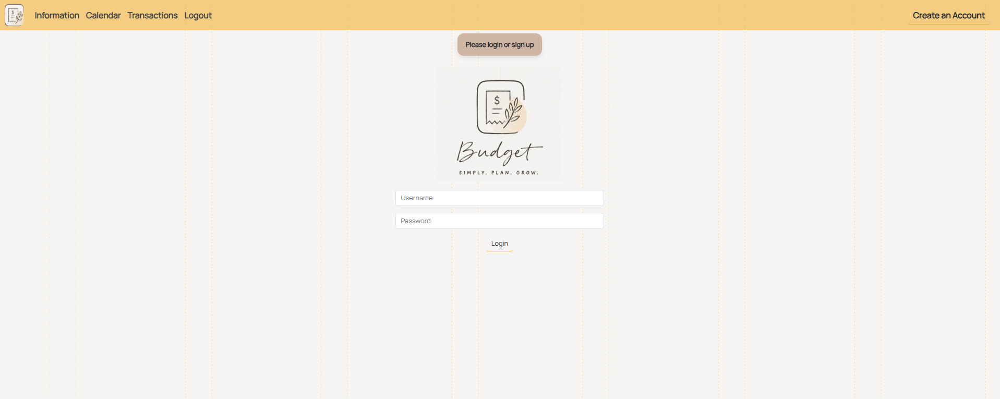
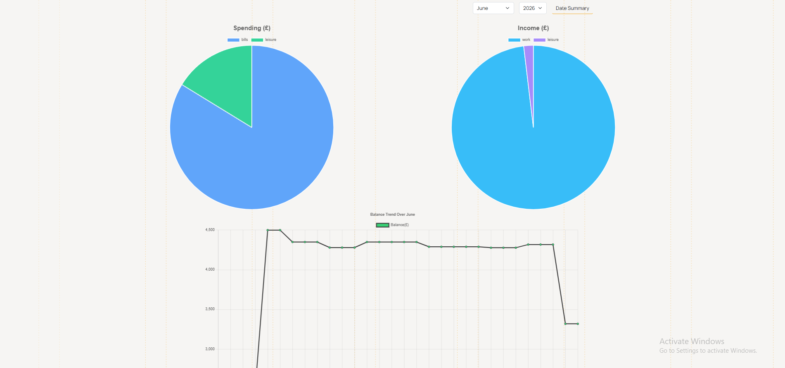
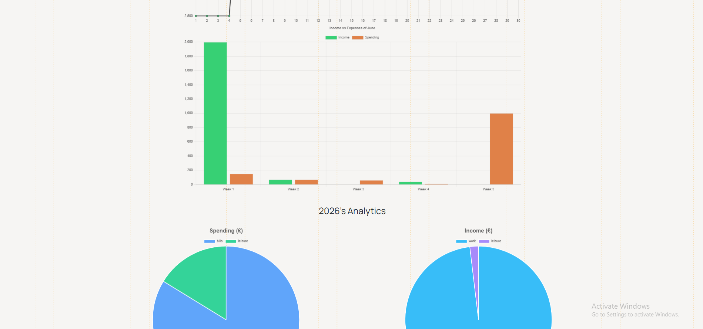
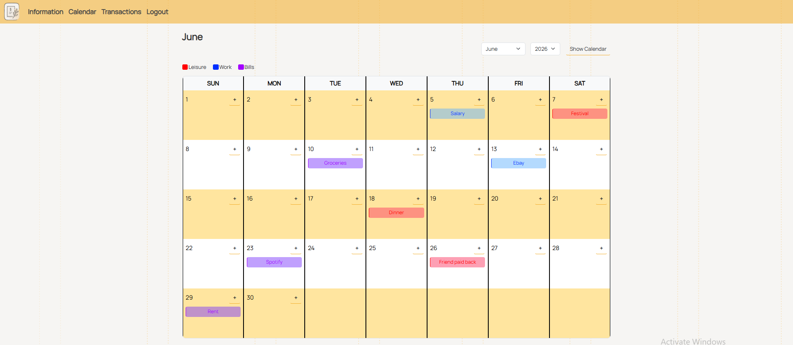
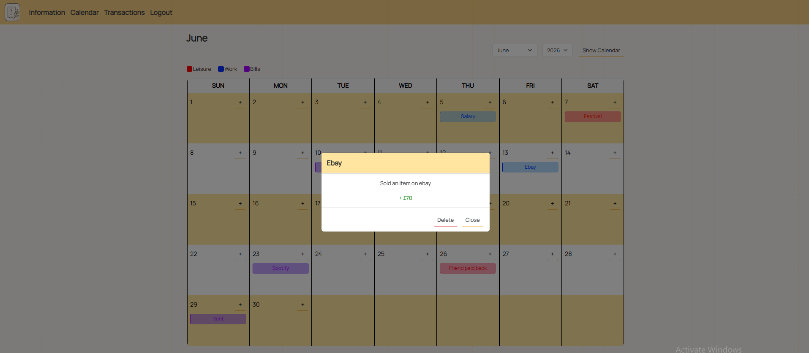

# Budgeting Web App

A simple budgeting web application built with **Flask**, **SQLite**, and **Bootstrap**, designed to show i can **DEPLOY, MAINTAIN and CODE a FULL STACK web application with a functional database**. 
Users can record income and expenses, set savings goals, and track spending trends through a clean dashboard.

https://budgeterapp-e0fa271274bb.herokuapp.com/

---

## Tech Stack
- **Backend:** Python (Flask) , Java
- **Frontend:** HTML, CSS (Bootstrap)
- **Database:** PostgreSQL
- **Deployment:** Heroku
- **CI/CD:** GitHub Actions (tests + auto-deploy)

---

## Features
- Add, edit, and delete income and expenses
- View total balance and monthly breakdown
- View charts and data of spending analytics
- Dashboard with spending summaries
- Authentication (login & register users)

---

## Tests

- Implemented testing using PyTest
- Implemented CI/CD using GitHub Actions
- Tests automatically run on pull or push to GitHub
  
---

## Screenshots

Login Page

Information Charts

Calendar

Past and Future Transactions

---

## Usage

- Register for an account
- Log in to your dashboard
- Add income/expenses
- Track savings goals

---

## Future Improvements

- Export data as csv
- Make website more user friendly
- Implement subscription type that automatically repeats every month
- Implement predictions on future earnings

---

## 👤 Author
**Rayan Butt**

[Linkedin](www.linkedin.com/in/rayan-butt-cs) | [Github](https://github.com/RayRB21?tab=overview&from=2025-07-01&to=2025-07-31)
